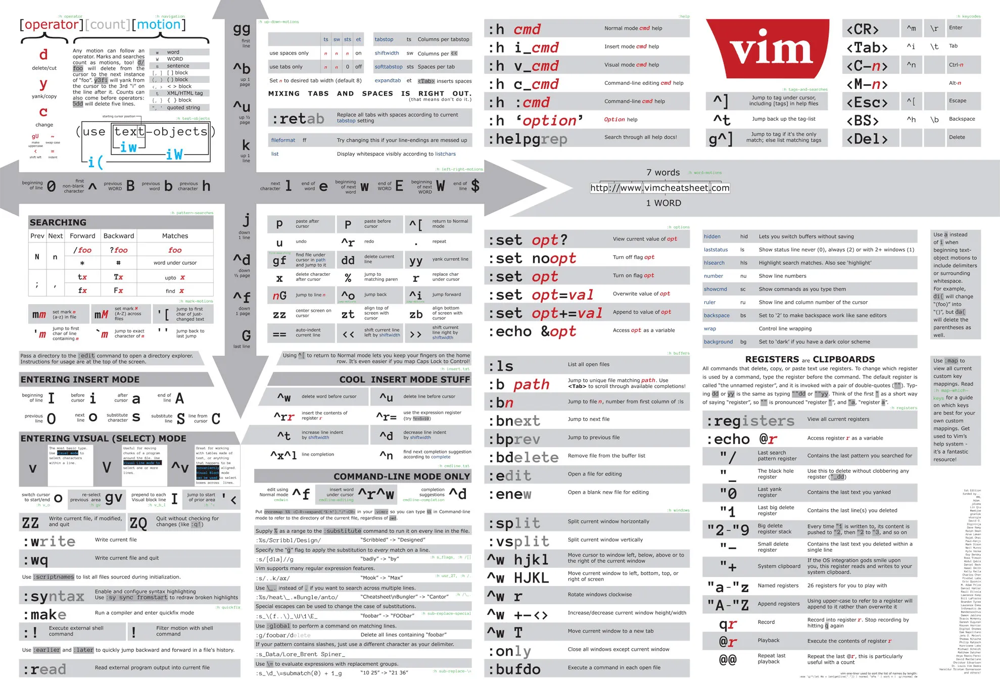

## Vim Cheat Sheets #nvim
	- 
	- 
- ## rip #rip
- Ideas for organising the downloads
	- List out the covers and sort it into a file, names will have the code in it somewhere
	- List out the titles, the codes can be extracted into a dict() code -> title
	- for code, title in enum(dict):
		- search for code in the jpg file list
		- if found
			- generate the rename
			- output to x.sh
			- remove cover from list
	- output the rest of the list if not extracted
-